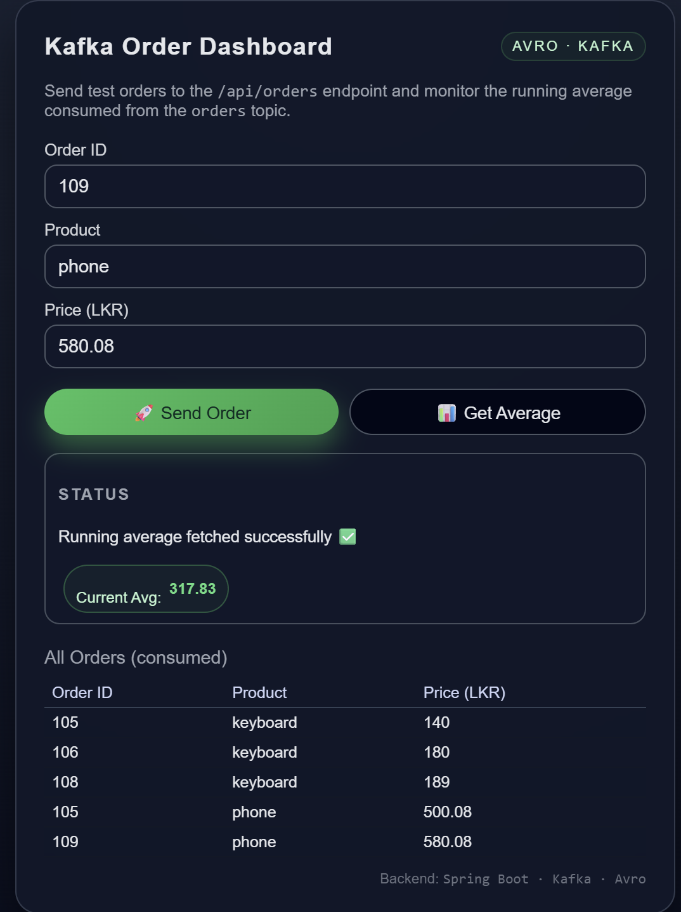
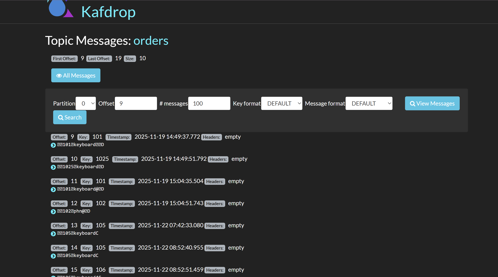

# 📦 Kafka Order Service

A Spring Boot microservice that publishes and consumes **Order** events via **Apache Kafka**.  
This project is typically used as a hands-on lab to learn:

- Kafka producers & consumers
- Spring Kafka configuration
- Topic configuration, consumer groups & offsets
- Running Kafka with Docker Compose
- Observing events with Kafka CLI tools

---

## 📚 Table of Contents

- [Architecture Overview](#-architecture-overview)
- [Features](#-features)
- [Tech Stack](#-tech-stack)
- [Project Structure](#-project-structure)
- [Getting Started](#-getting-started)
  - [Prerequisites](#prerequisites)
  - [Clone & Build](#clone--build)
  - [Run Kafka with Docker Compose](#run-kafka-with-docker-compose)
  - [Run the Application](#run-the-application)
- [Configuration](#-configuration)
- [REST API Endpoints](#-rest-api-endpoints)
  - [Create Order (Producer)](#1-create-order-producer)
  - [Get All Orders](#2-get-all-orders)
  - [Health Check](#3-health-check)
- [Kafka CLI Commands](#-kafka-cli-commands)
- [How It Works](#-how-it-works)
- [Troubleshooting](#-troubleshooting)
- [Future Improvements](#-future-improvements)
- [License](#-license)

## Kafka Order Dashboard UI

  

## 🧱 Architecture Overview

###Flow summary:

Client sends an HTTP request (e.g. POST /api/orders).

KafkaOrderService publishes an OrderCreated event to the Kafka topic orders.

A Spring Kafka consumer (same service or a separate one in advanced setups) listens to orders and processes messages.

Processed results can be logged, stored, or forwarded.

## ✨ Features
Produce Order events to a Kafka topic.

Consume Order events from Kafka.

Configurable topic names, bootstrap servers, and consumer groups.

Example REST API for triggering producers.

Example Kafka CLI commands to inspect messages.

Ready to run with Docker Compose.

## 🛠 Tech Stack
Language: Java 21+

Framework: Spring Boot 3.x

Messaging: Apache Kafka

Build Tool: Maven

Containerization (optional): Docker & Docker Compose

## 📁 Project Structure
This is a typical structure; adapt it if your package names differ.

kafka-order-service/
├─ src/
│  ├─ main/
│  │  ├─ java/com/example/kafkaorderservice/
│  │  │   ├─ KafkaOrderServiceApplication.java
│  │  │   ├─ controller/
│  │  │   │   └─ OrderController.java
│  │  │   ├─ service/
│  │  │   │   ├─ OrderService.java
│  │  │   │   └─ KafkaOrderProducer.java
│  │  │   ├─ consumer/
│  │  │   │   └─ KafkaOrderConsumer.java
│  │  │   └─ model/
│  │  │       └─ Order.java
│  │  └─ resources/
│  │      ├─ application.yml
│  │      └─ logback-spring.xml (optional)
│  └─ test/
│      └─ ... (unit / integration tests)
├─ Dockerfile
├─ docker-compose.yml (or infra/docker-compose.yml)
├─ pom.xml
└─ README.md
## 🚀 Getting Started
Prerequisites
Java 21+

Maven 3.9+

Docker & Docker Compose (for local Kafka)

cURL or Postman for testing the API

Clone & Build

git clone https://github.com/<your-username>/kafka-order-service.git
cd kafka-order-service

## Kafdrop Topic Messages

  

# Build the project
mvn clean package
Run Kafka with Docker Compose
If you have an infra/docker-compose.yml (or similar), run:

# From project root
docker compose -f infra/docker-compose.yml up -d
Common setup:

Kafka broker inside Docker network: kafka:9092

Kafka broker from host machine: localhost:29092 (mapped from container)

Check containers:

docker ps
You should see something like kafka-labs-kafka-1 or kafka-1.

Run the Application
Using Maven:

mvn spring-boot:run
Or using the JAR:

java -jar target/kafka-order-service-0.0.1-SNAPSHOT.jar
By default, the app usually runs on:

Base URL: http://localhost:8080

## ⚙ Configuration
Example application.yml:

server:
  port: 8080

spring:
  application:
    name: kafka-order-service

  kafka:
    bootstrap-servers: localhost:29092   # Or kafka:9092 inside Docker
    consumer:
      group-id: order-consumer-group
      auto-offset-reset: earliest
      key-deserializer: org.apache.kafka.common.serialization.StringDeserializer
      value-deserializer: org.apache.kafka.common.serialization.StringDeserializer
    producer:
      key-serializer: org.apache.kafka.common.serialization.StringSerializer
      value-serializer: org.apache.kafka.common.serialization.StringSerializer

app:
  kafka:
    order-topic: orders
⚠ If running the app inside Docker, use kafka:9092.
If running the app on your host, but Kafka is in Docker, use localhost:29092 (or whatever you mapped).

## 🌐 REST API Endpoints
Base URL: http://localhost:8080/api/orders

1. Create Order (Producer)
POST /api/orders

Sample request:

curl -X POST "http://localhost:8080/api/orders" \
  -H "Content-Type: application/json" \
  -d '{
        "orderId": "ORD-1001",
        "customerId": "CUST-2001",
        "amount": 1500.75,
        "status": "CREATED"
      }'
Expected behavior:

Order payload is validated.

An OrderCreated event is sent to the Kafka topic orders.

Application logs show producer sending message.

2. Get All Orders
If you store consumed orders (e.g., in memory or DB):

GET /api/orders

curl "http://localhost:8080/api/orders"
3. Health Check
GET /actuator/health (if Spring Actuator is enabled) or:

GET /api/orders/health (if you created a custom endpoint)

curl "http://localhost:8080/actuator/health"
🔍 Kafka CLI Commands
List Topics

docker exec -it kafka-labs-kafka-1 \
  kafka-topics --bootstrap-server kafka:9092 \
  --list
Describe the orders Topic

docker exec -it kafka-labs-kafka-1 \
  kafka-topics --bootstrap-server kafka:9092 \
  --describe --topic orders
Consume Messages from the Beginning
🔁 This is an alternative to the command with --property print.key=true you may have used earlier.

Simple consumer (no key printing):

docker exec -it kafka-labs-kafka-1 \
  kafka-console-consumer --bootstrap-server kafka:9092 \
  --topic orders \
  --from-beginning
Consumer with key & headers printed:

docker exec -it kafka-labs-kafka-1 \
  kafka-console-consumer --bootstrap-server kafka:9092 \
  --topic orders \
  --from-beginning \
  --property print.key=true \
  --property print.headers=true \
  --property key.separator=" : "
Produce a Test Message (Manual)

docker exec -it kafka-labs-kafka-1 \
  kafka-console-producer --bootstrap-server kafka:9092 \
  --topic orders
Then type a line like:

{"orderId": "ORD-CLI-1", "amount": 999.99}
🔄 How It Works
OrderController receives REST calls.

OrderService validates & builds the domain Order object.

KafkaOrderProducer sends the serialized event (JSON) to the orders topic.

KafkaOrderConsumer listens on the orders topic:

Logs messages.

Optionally saves them into DB / in-memory store.

You can observe messages using Kafka CLI or logs.

##🧯 Troubleshooting
1. Connection to node 1 (localhost/127.0.0.1:29092) could not be established
Check if Kafka is running:

docker ps
Ensure bootstrap-servers matches your setup:

Inside Docker: kafka:9092

From host: localhost:29092 (or your mapped port)

If using Docker Compose, verify KAFKA_ADVERTISED_LISTENERS in your docker-compose.yml.

2. Messages Not Appearing in kafka-console-consumer
Make sure you are consuming from the same topic (orders).

Use --from-beginning to read existing messages.

Check consumer group-id:

If you want to re-read from the start, change group-id or reset consumer offsets.

3. Spring Boot App Fails to Start
Check logs for:

Wrong Kafka address.

Port already in use (8080).

Try cleaning and rebuilding:

mvn clean package
## 🧭 Future Improvements
Add a proper database (PostgreSQL, MySQL) for order persistence.

Add Avro/Schema Registry for strongly-typed messages.

Add integration tests with Testcontainers (Kafka).

Add Grafana/Prometheus for metrics and monitoring.

Split producer and consumer into separate microservices.
---
## 📄 License
This project is open for learning and experimentation.
You may adapt it freely for educational or internal use. Add a proper license (e.g. MIT/Apache-2.0) if you plan to open-source it
